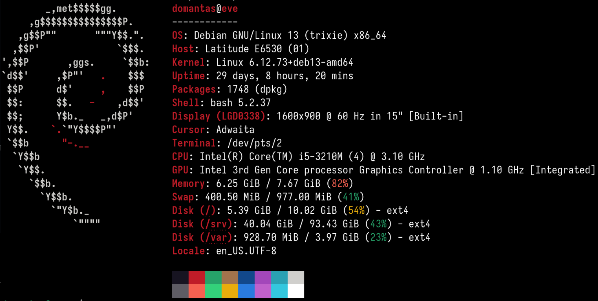

# Debian Homelab
This repository documents my experience with Linux, virtualization, networking and containerization inside a homelab.

## Technologies used
- Linux (Debian, Red Hat)
- KVM/QEMU virtualisation
- Nginx
- Podman / Docker
- Networking

## What I worked on
- Deploying, managing and troubleshooting virtual machines using KVM/QEMU
- Running a local DNS server using Unbound
- Running services in Podman containers
- Setting up and configuring an Nginx web server
- Setting up remote access with Tailscale ssh

