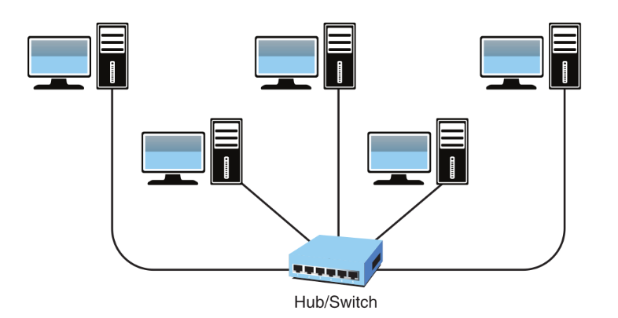
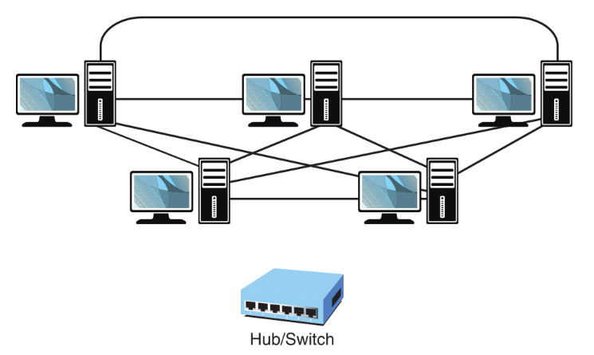
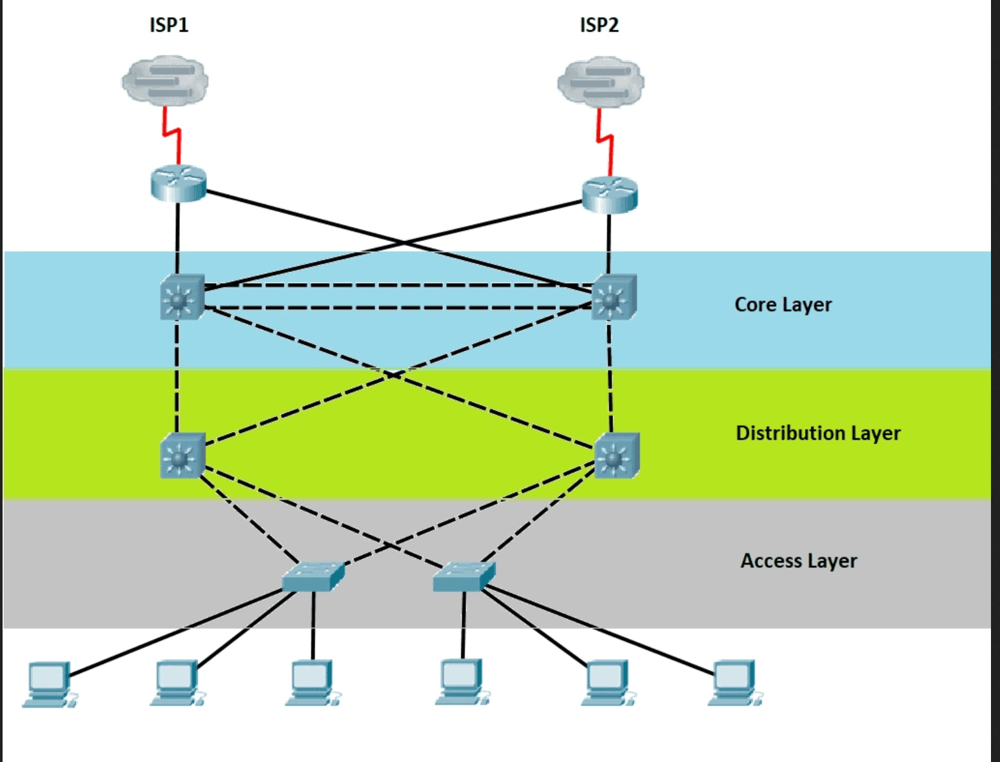
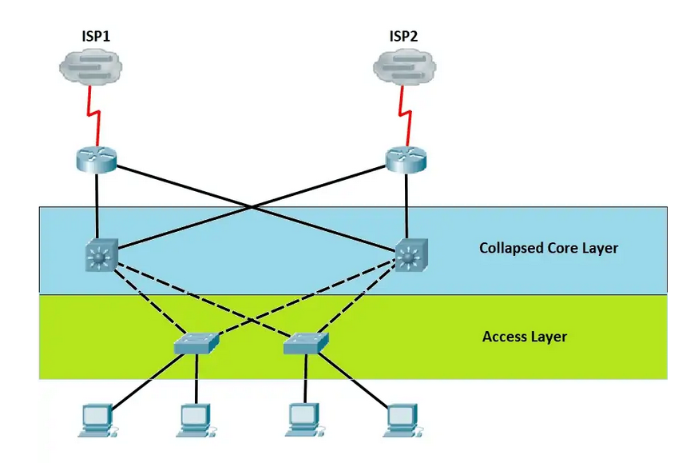

# Star/Hub and Spoke

- In a star topology, all network devices connect to a central device called a hub or a switch.
- It's the most widely adopted topology.
- Scalable, easy to troubleshoot.
- Central connecting device allows for a single point of failure, requires additional networking equipment to set up.
# Mesh

- Each network device connects to every other, creating a point-to-point connection between every device on the network.
- Popular with servers/routers.
- Wiring is expensive and complicated.
- Mesh provides redundancy and can be expanded without disruptions.
# Hybrid

- Creates a redundant point-to-point network connection between only specific network devices (such as the servers).
- This hybrid mesh is most often seen in WAN implementations.
- For example, star/hub and poke bus - a combination of the star/hub and spoke topology and the bus topology.
# Point to point

- Network configuration where two nodes are directly connected to each other. It's not scalable and is not used to connect to a network.
# Spine and leaf

- Two-tier model.
- The spine is responsible for interconnecting all the leaf switches in a full-mesh topology.
- Every leaf is connected to every spine, and the path is randomly chosen.
- Traffic always needs to go through the same number of devices.
- In Top-of-rack (ToR) switching, switches located within the same rack are connected to an in-rack network switch, which is connected to aggregation switches.
# Three-tier

- Consists of the Core layer, Distribution/Aggregation layer and the Access/Edge layer.
- Core layer:
	- Could be a web server, a database or an application.
	- The place where switching and routing meet.
	- Provides high speed and redundancy forwarding services to move packets between distribution layer devices in different regions of the network.
	- Core switches incorporate internal firewall capability.
- Distribution/Access layer:
	- MIdpoint between the core and the users.
	- Place where QoS policies are managed, filtering is done, and routing takes place.
	- Communication between access switches.
	- Manages the path between end users.
	Access/Edge layer:
	- Where the users connect.
	- Interfaces directly with end devices, such as computers, printers...
# Collapsed core

- Core and distribution layers are combined.
# Bus

# Ring

# Traffic flows
- North-south traffic refers to data flowing into or out of a server or datacenter, for example accessing cloud services, browsing the internet.
- East-west traffic relates to the traffic flow between internal resources within a network, such as inter-server communication, database queries.
